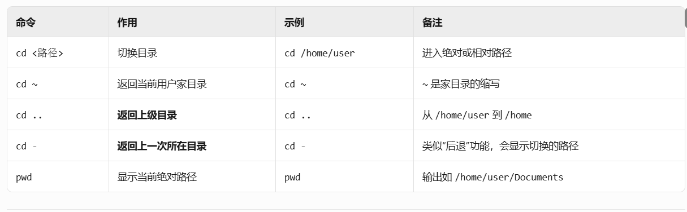
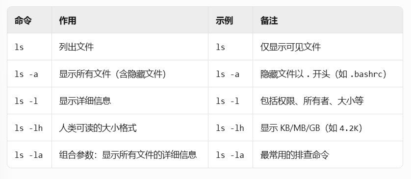
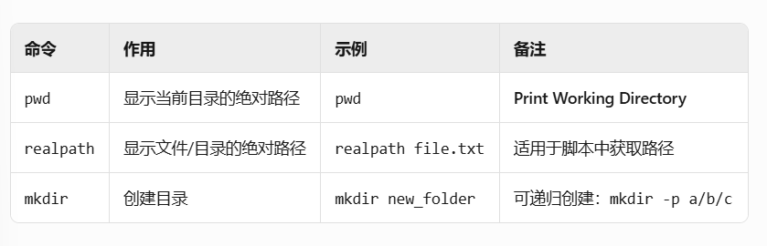
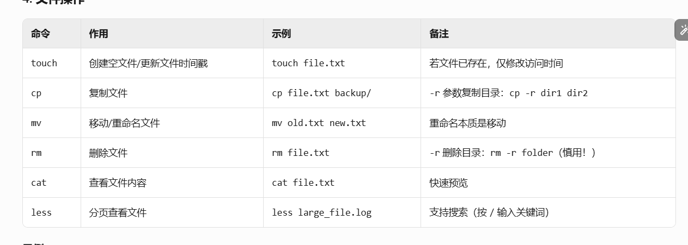
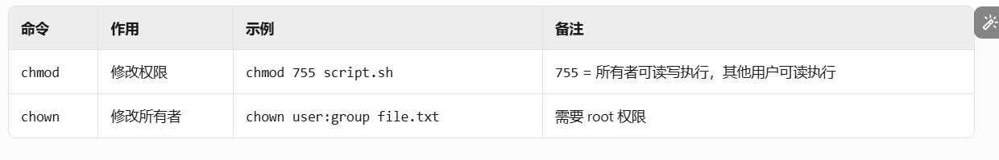
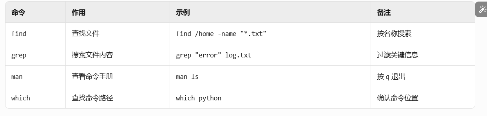
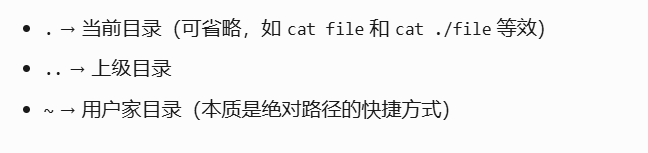

## 软连接&硬连接
### 软连接 
A.sh(Node.id=123) --->B.sh(Node.id=456)
A文件是应用程序  B文件是快捷方式，B的作用就是找到A文件  如果A消失则B找不到A就会报错
1. 相当于Windows的快捷方式
2. 是一个独立的文件，有自己的inode编号（如例子中A是123，B是456）
3. 存储的是目标文件的路径信息
4. 特点：
- 可以跨文件系统
  （软连接存储的是​​目标文件的路径字符串​​，而不是直接指向 node。id因此，只要路径有效，软连接就能找到目标，无论目标在哪个文件系统上。）
- 可以链接目录（只是存储路径，并不会造成循环卡死）
- 源文件删除后，软连接失效（成为"悬空链接"）
- 如果源文件被移动或重命名，链接会断开
### 硬连接
A.sh(Node.id=123) <---C.sh(Node.id=123)
A和C文件都指向Node.id=123，若A被删除，则C仍能找到Node.id=123处
只要有目录指向Node.id=123处，Node.id=123就不会消失
1. 是同一个文件的多个目录入口
2. 与源文件共享相同的inode编号（如你的例子中A和C都是123）
3. 本质上是同一个文件的多个名称
4. 特点：
- 不能跨文件系统（硬连接直接指向Node.id，必须在​​同一个文件系统​​内，因为它们直接共享Node.id，而不同文件系统的 inode 编号是独立的。
）
- 不能链接目录(防止进入循环，卡死)
- 删除一个硬链接不会影响其他链接
- 只有当所有硬链接都被删除，文件才会真正被删除
#### 应用示例
app1 因为更新有许多版本（1.0，2.0，3.0....）
而app2是基于app1来工作的，此时只需一个软连接app，从app1连接到app,再从app连接到app2,那么每当app1发生更新时候，只需更改新版本的从app1到app的连接即可，app2处不用再做改动

app1-v1.0 (实际文件)
app1-v2.0 (实际文件)
app1-v3.0 (实际文件)

app -> app1-v3.0 (软连接，可随时更改指向的版本)
app2 -> app (软连接)

## 补充说明
1. 查看链接：
ls -li 可以查看inode编号
stat 文件名 查看详细信息
2. 创建命令：
软连接：ln -s 源文件 链接文件
硬链接：ln 源文件 链接文件
3. 硬链接计数：
每个文件的硬链接数可以通过ls -l的第二列看到
新建文件默认硬链接数为1
每创建一个硬链接，计数+1

## Home 的概念
一台电脑可以有多个操作者，eg.张三，李四，王五，每当他们登录电脑后，都会显示的是独属于他们个人的桌面，而这个桌面就存储在Home文件下
电脑根目录下的User文件下的张三的Home文件，下有desktop,document等文件

## 操作指令
1. 目录导航
   
2. 查看目录内容
   
3. 路径操作
   
4. 文件操作
   
5. 权限管理
   
6. 查找与帮助
   
## 绝对路径&相对路径
1. 绝对路径（Absolute Path）​​
​​定义​​：从 ​​根目录（/）​​ 开始的完整路径，唯一指向文件或目录的位置。
2. 特点
   - 以 / 开头（如 /home/user/file.txt）
   - 在任何目录下执行都指向同一个目标
   - 适合脚本、配置文件等需要确定性的场景

3. 相对路径（Relative Path）​​
​​定义​​：从 ​​当前工作目录（pwd）​​ 出发的路径，依赖上下文。
4. 特点：
   - 不以 / 开头（如 Documents/project）
   - 执行结果随当前目录变化
   - 适合快速操作，减少输入长度
5.  
  