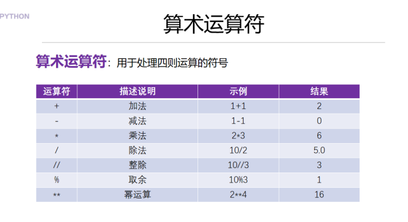
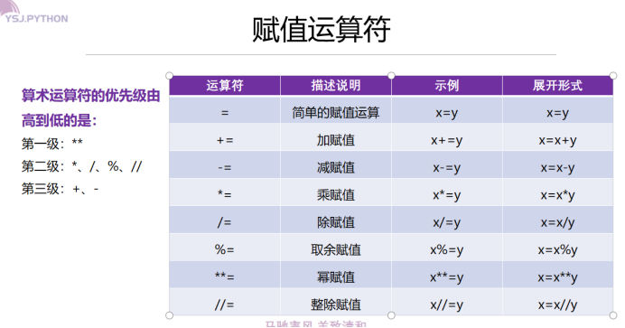
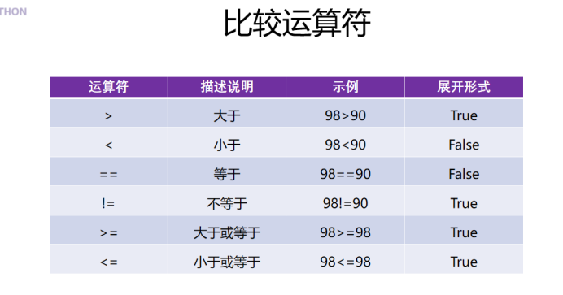
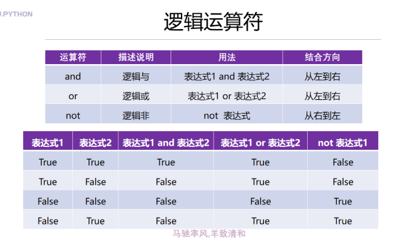
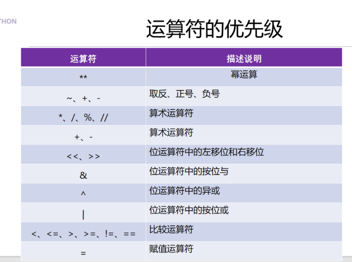

Python运算
一、算术运算符
（一）先乘除后加减，有括号先算括号

二、赋值运算符

三、比较运算符
（一）运算结果为布尔型

四、逻辑运算符
（一）运算结果为布尔型
（二）A and B 若A为假，B不会再执行运算
（三）A or B 若A为真，B不会再执行运算

五、位运算：数字转换成二进制数字运算
（一）按位与（&）
（二）按位或（|）
（三）异或（^）：同0异1
（四）取反（~）
（五）左位移
1.高位溢出舍弃，低位缺少补0
2．左移n位，数值=自身*自身的n次方
（六）右位移
1．低位溢出舍弃，高位缺少根据最高位的数字来补，最高位为0则补0，最高位为1则补1
2．右移n位，数值=自身/自身的n次方
六、运算顺序（有括号先算括号）
优先级规则（从高到低）：
1．() 括号
2．** 幂运算
3．~ 按位取反
4．* / // %
5．+ -
6．<< >> 位移
7．& 按位与
8．^ | 按位异或/或
9．== != > < >= <= 比较
10．not and or 逻辑
11．= 赋值类

