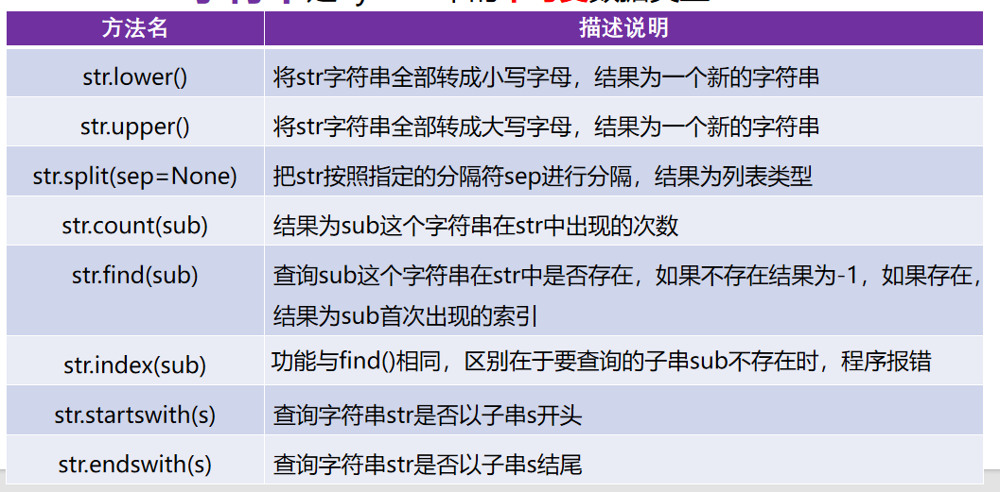
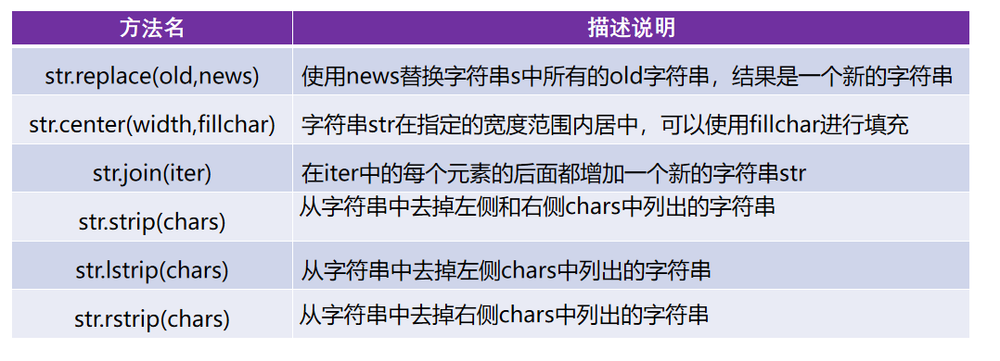
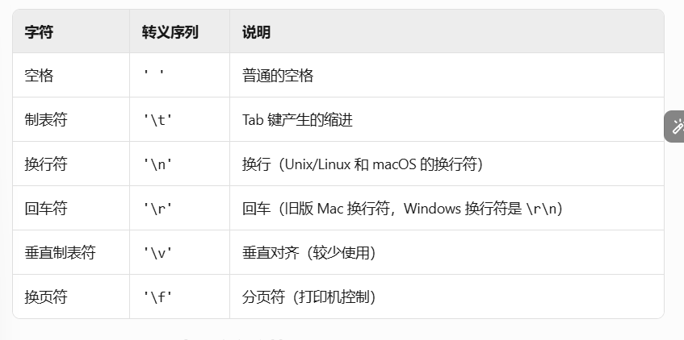
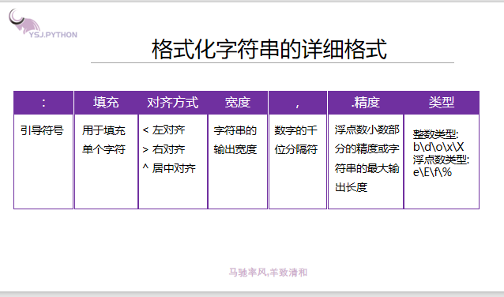
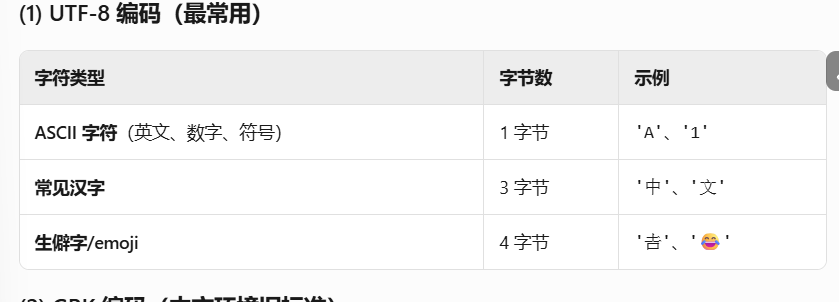
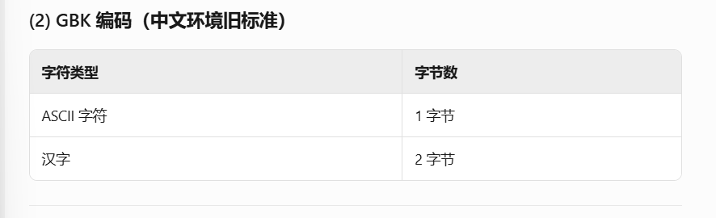
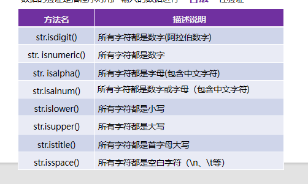

## 字符串的常用操作
1.
 

2. s.replace可以指定替换次数，默认是替换全部
 ```
   new_s=s.replace('o','你好',1) # 最后一个参数是替换次数，默认是全部替换
   print(new_s)
```
3. s.strip([chars]) 移除字符串开头和结尾的指定字符
   - chars​​（可选参数）：指定要移除的字符集合（字符串形式）。如果省略或为 None，默认移除空白字符（包括空格、制表符 \t、换行符 \n 等）
   - 没有顺序，会根据指定字符串的每个字符去移除首尾的所有相同字符，直至遇到其他字符,不能移除字符串中的字符
    ```
    text = "xxxyHello, xyWorld!yyyx"
    result = text.strip("xy")
    print(result)  # 输出: "Hello, xyWorld!"
   ```
4. 字符串是不可变数据类型，==所以所有的函数都不会更改原字符串，而是生成一个新的字符串==
5. 空白字符是指那些在屏幕上不可见但会影响字符串格式的特殊字符。
   
## 字符串的输出：格式化字符串可以简洁不同数据类型间的连接，格式化字符串是指按照特定规则动态插入变量或表达式的字符串。
## 格式化字符串的三种方式：
1. 占位符方式
   - %s :字符串格式
   - %d :十进制整数格式
   - %f :浮点数格式
```
name='马冬梅'
age=18
score=98.5
print('姓名:%s,年龄:%d,成绩:%f' % (name,age ,score))
print('姓名:%s,年龄:%d,成绩:%.1f' % (name,age ,score))
#%.1f保留一位小数
```
2. f-string方式
```
print(f'姓名:{name},年龄:{age},成绩:{score}')
```

3. str.format()方式：模板字符串.format(用逗号分隔的参数)
    1. 按照索引填充
    ```
    print('姓名:{0},年龄:{1},成绩:{2}'.format(name,age,score))
    print('姓名:{2},年龄:{0},成绩:{1}'.format(age,score,name))
    #{}中的是对应后方.format()中的对应变量的下标
    ```
    2. 默认填充
    ```
    text = "Hello, {}!".format("Alice")
    print(text)  # 输出: "Hello, Alice!"
    ``` 
    3. 按关键字填充
    ```
    text = "Name: {name}, Age: {age}".format(name="Alice", age=25)
    print(text)  # 输出: "Name: Alice, Age: 25"
    ```
4. str.format()格式控制语法

```
s='helloworld'
print('{0:*<20}'.format(s)) # 字符串的显示宽度为20，左对齐，空白部分使用* 号填充
print('{0:*>20}'.format(s))
print('{0:*^20}'.format(s))

#千位分隔符（==只适用于整数和浮点数==）
print('{0:,}'.format(987654321))
print('{0:,}'.format(987654321.7865))

#浮点数小数部分的精度
print('{0:.2f}'.format(3.1419826))
#字符串类型 .表示是最大的显示长度
print('{0:.5}'.format('helloworld')) # hello

#整数类型
a=425
print('二进制:{0:b},十进制:{0:d},八进制:{0:o},十六进制:{0:x},十六进制：{0:X}'.format(a))

#浮点数类型
b=3.1415926
print('{0:.2f},{0:.2E},{0:.2e},{0:.2%}'.format(b) )

```
## 字符串的编码和解码
1. 同一字符串的编码和解码必须用同一编码格式，同一使用'utf-8'或者'GBK'，默认是'utf-8'形式
2. 字符串编码：将str类型转换成bytes类型，需要使用到字符串的encode()方法
- str.encode(encoding=‘utf-8’,errors=‘strict/ignore/replace’)

3. 字符串解码：将bytes类型转换成str类型，需要使用到bytes类型的decode()方法
- bytes.decode(encoding=‘utf-8’,errors=‘strict/ignore/replace’)

注意：
1. errors=‘strict/ignore/replace’即在编码和解码过程中遇到的错误三种解决形式：strict直接报错，ignore忽略，replace用？代替不能转换的字符
2. 字节&字符：
- 字符（Character）​​：是文本的基本单位（如 'A'、'中'）。
​- ​字节（Byte）​​：是存储单位，字符的存储长度取决于编码方式。
- 不同编码下的字符占用字节数​



## 数据的验证：对用户输入的数据进行“合法”性验证

- s.isnumeric() 可以识别“123”，“一二三”，“壹贰叁”，'ⅢⅢⅢ',但不能识别“0b1010”
- s.isalpha()无法识别'123','ⅢⅢⅢ'
- 中文既是大写也是小写
- s.istitle()仅有首字母大写才为True

## 字符串的处理
### 字符串的拼接
1. 用'+'
```
print(s1+s2)
```
2. 使用str.join()方法进行拼接字符串
```
print(''.join([s1,s2])) # 使用空字符串进行拼接
```
== 在''中可以加任意字符用来拼接 ==
3. 使用str.join()方法进行拼接字符串
```
print('hello''world')
```
4. 使用格式化字符串进行拼接
```
print('%s%s' % (s1,s2))
print(f'{s1}{s2}')
print('{0}{1}'.format(s1,s2))
```
### 字符串的去重：创建一个空字符串，与目标字符串一个一个元素进行比较，若元素空字符串没有，则进行拼接，有则跳过
1. 字符串拼接及not in
```
new_s=''
for item in s:
    if item not in new_s:
        new_s+=item # 拼接操作
print(new_s)
```
2. 使用索引+not in
```
new_s2=''
for i in range(len(s)):
    if s[i]  not in new_s2:
        new_s2+=s[i]
print(new_s2)
```
3. 通过集合去重+列表排序(集合特点是无序且不重复可以做到去重，但要想恢复原来顺序，需用列表进行排序)
```
new_s3=set(s) #利用集合的​​唯一性​​自动去重
lst=list(new_s3) #合是无序的，转为列表后方便后续排序
lst.sort(key=s.index) #对列表 lst 进行排序，排序依据是字符在原始字符串 s 中的首次出现位置,此时已经进行完去重操作，仅需对剩余的不重复字符进行排序
print(''.join(lst)) # 将排序后的列表 lst 拼接成一个字符串并输出
```


