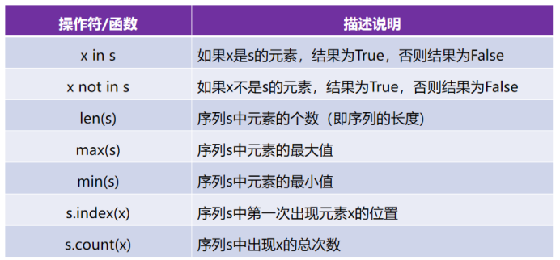
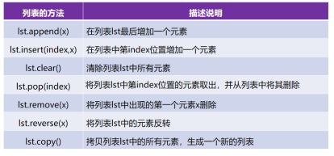
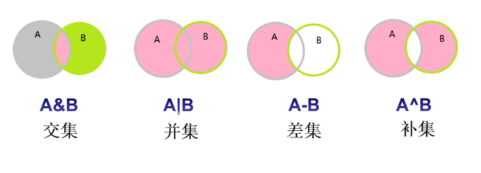
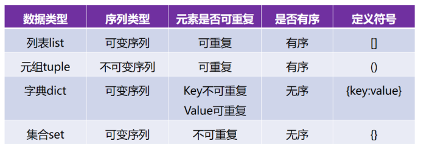
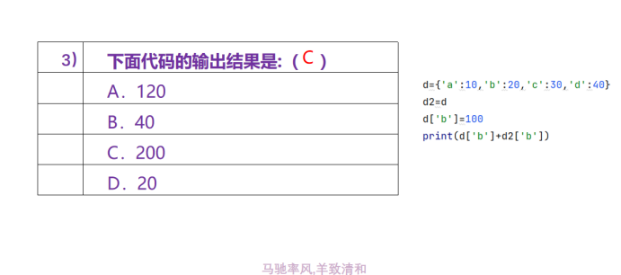
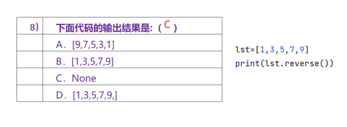

# 组合数据类型
序列结构（组合数据类型）：列表、元祖、集合、字典

### 索引：反向递减（-1,-N）,正向递增（0,N-1）
```
# 正向递增
s='helloworld'
for i in range(0,len(s)):
    print(i,s[i],end='\t\t')
print('\n--------------------')
# 反向递减
for i in range(-10,0):
    print(i,s[i],end='\t\t')
print('\n',s[9],s[-1])
```
### 序列操作：
（一）切片访问数据，切片是访问一个范围的数据
1. 序列[start：end：step] start默认0   end默认到最后元素  step默认步长为1
代码：
print(s[5::])
print(s[5:]) # 12行代码与13行代码功能相同，省略了结束，省略了一个步长

2. 步长为负数，倒序输出元素
```
# 步长为负数
print(s[::-1]) # 可以使用哪句代码替换呢
print(s[-1:-11:-1]) 
```
（二）操作
1. 相加‘+’
2. 相乘‘*’
3. 操作符
（1）函数
（2）方法（需要用‘.’使用）  

**注意**：max(s)，min(s)是按照ASCII码值来排序
```
s='helloworld'
print('e在helloworld中存在吗?',('e'in s)) # in的使用
print('v在helloworld中存在吗?',('v'in s))

# 序列对象的方法，使用序列的名称，打点调用
print('s.index():',s.index('o')) # o在s中第一次出现的索引位置 4
#print('s.index():',s.index('v')) # ValueError: substring not found ,报错的原因是v在字符串中根本不存在，不存在所以找不到
print('s.count():',s.count('o')) # 统计o在字符串s中出现的次数
```


## 列表：
①　可以存储任意类型数据，且数据类型可以不同
②　列表是可变数据类型，即元素个数发生变化，但内存地址不变

1. 创建列表：
（一）直接用[]：列表名=[element1,element2,......elementN]
```
lst=['hello','world',98,100.5]
print(lst)
```
（二）用list()：列表名=list(序列)
```
lst2=list('helloworld')
lst3=list(range(1,10,2)) # 从1开始到10结束，步长为2，不包含10
print(lst2)
print(lst3)

lst2=list('hello', 'wd', 23, 55.02)是错误的，因为 list() 函数在创建列表时只能接受一个可迭代对象作为参数，而不能直接接受多个参数来初始化列表元素
```
（三）列表生成式
①　lst=[expression for item in range] 循环几次就代表列表有几个元素
②　lst=[expression for item in range if condition]
```
lst=[item for item in range(1,11)]  #item就是列表中的元素
print(lst)

lst=[item*item for item in range(1,11)]   #item*item就是列表中的元素 
print(lst)

lst=[random.randint(1,100) for _ in range(10)]   #‘_’原是item，但此处的item对于列表无用，可以用‘_’代替，此列表的元素是1-100的十个随机数
print(lst)

# 从列表中选择符合条件的元素组成新的列表
lst=[i for i in range(10) if i%2==0]
print(lst)
```

2. 列表删除：del 列表名
```
# 列表的删除操作
lst4=[10,20,30]
print(lst4)
# 删除列表
del lst4
#print(lst4) # NameError: name 'lst4' is not defined. Did you mean: 'lst'?
```


3. Enumberate()函数：enumerate(枚举对象, 起始位置（默认start=0）)
for index ,item in enumerate(lst):     输出序号（index）和元素（item）
```
fruits = ["apple", "banana", "cherry"]
for index, fruit in enumerate(fruits):
    print(index, fruit)
结果：
0 apple
1 banana
2 cherry
```
**注意：** index是一个序号，并不是索引下标，index是可变化的，可手动修改，若start=1，则index是从1开始

4. 列表遍历：
（一）for循环
代码：
for item in lst:
    print(item)
（二）for循环+索引
代码：
for i in range(0,len(lst)):
    print(i,'-->',lst[i])
（三）Enumberate()
```
for index,item in enumerate(lst):
    print(index,item) #index是序号，不是索引
# 手动修改序号的起始值
for index,item in enumerate(lst,start=1): #
    print(index,item)

for index, item in enumerate(lst,1):  #  省略start不写，直接写起始值
    print(index, item)
```
5. 列表排序：	
（一）列表对象sort  lst.sort(key=None,reverse=False)   不产生新的列表，key 是排序规则，reverse是排序方式，默认值是False是代表升序
```
# 排序，默认是升序
lst.sort() # 排序是在原列表的基础上进行的，不会产生新的列表对象
print('升序:',lst)
```
（二）内置函数     sorted() sorted(iterable,key=None,reverse=False)    产生新的列表，iterable是排序对象，key 是排序规则，reverse是排序方式，默认值是False是代表升序
```
asc_lst=sorted(lst)

# 忽略大小写进行排序
new_lst2=sorted(lst2,key=str.lower)  #key=str.lower：指定排序的关键函数（key function），即在比较元素时，先将每个元素转换为小写形式，再进行比较。在比较时，str.lower 方法会临时将每个字符串转换为小写，但不改变原数据
print('原列表:',lst2)
print('排序后的列表:',new_lst2)
```
**注意：**
①　英文单词排序按照ASCII码值排序，大写字母ASCII值小于 小写字母
②　若想忽略大小写字母，则需将元素均转化为小写或大写
```
# 忽略大小写进行比较
lst2.sort(key=str.lower)
print(lst2)
```
③　为什么print(lst.sort())为什么不能直接输出排序后的序列？
1)lst.sort() 会对列表 lst 进行排序，但 不会返回新的列表，而是直接修改原列表。
2)它的返回值是 None，所以 print(lst.sort()) 会输出 None。


6. 列表相关操作：
①　 列表是序列中的一种，对序列的操作符，运算符，函数均可以使用
②　

③　lst.reverse()不需要参数

7. 二维列表：是一个表格，一个列表里嵌套需要列表，每一个元素都是一个列表
二维列表的遍历：
for row in 二维列表:
        for item in row:
             pass
```
# 创建二维列表
lst=[
    ['城市','环比','同比'],
    ['北京',102,103],
    ['上海',104,504],
    ['深圳',100,39]
]
print(lst)

# 遍历二维列表使用双层for循环
for row in lst: # 行
    for item in row: # 列
        print(item,end='\t')
    print()# 换行


# 列表生成式生成一个4行5列的二维列表
lst2=[ [j for j in range(5)]for i in range(4)]
print(lst2)
①　for i in range(4)代表有四行
②　 [j for j in range(5)]表示每一个元素都是[]形式，都是一个列表，for j in range(5)表示每一行有五个元素，即五列。j而每一行的元素是j
```


## 元组：
①　可以存储任意类型数据，且数据类型可以不同
②　不可变数据类型
③　元组中元素用英文逗号隔开，元组中只有一个元素的时候，逗号也不能省略
```
# 如果元组中只有一个元素
t=(10)
print(t,type(t))   #int类型

# 如果元组中只有一个元素，逗 号不能省
y=(10,)
print(y,type(y))    #tuple类型
```
1. 元组的创建：
①　直接使用（），元组名=(element1,element2,......elementN)
```
t=('hello',[10,20,30],'python','world')
print(t)
```
②　用内置函数tuple()，元组名=tuple(序列)
```
t=tuple('helloworld')
t=tuple([10,20,30,40])  #结果：10  20  30  40  ，元组中的元素就是列表中的元素
print(t)
```
③　元组生成式，生成一个生成器，无法直接遍历看到结果
1)解决方法一：转化成元组或列表再遍历显示
```
t=(i for i in range(1,4))
print(t)
t=tuple(t)
 print(t)
# 遍历
for item in t:
     print(item)
     ```
2)解决方法二：使用__next__()从生成器中取出元素，一次只能取出一个元素
```
t=(i for i in range(1,4))
print(t.__next__())
print(t.__next__())
print(t.__next__())
```
**注意：** 两个解决方法只能选其中一个，不能混用。如果用方法一则生成器中的数据都被转换成元组或列表类型，无法使用__next__()从生成器中取出生成器类型元素。如果使用方法二使用__next__()从生成器中取出元素，元素取完后，生成器中没有元素了，无法再从生成器类型换成元组或列表类型。

2. 元组操作：
（一）切片操作
```
t2=t[0:3:2] # 元组支持切片操作
print(t2)
```
（二）用索引进行访问
```
print(t[0])
```
（三）遍历
1．for循环
```
for item in t:
    print(item)
```
2．for循环+索引
```
# for+range()+len()
for i in range(len(t)):
    print(i,t[i])
```
3．Enumberate()
```
for index,item in enumerate(t):
    print(index,'---->',item)

for index,item in enumerate(t,start=11): # 序号从11开始
print(index,'---->',item)
```
（四）序列操作也可以使用
（五）元组的删除 del 元组名


## 字典：
①　字典是根据一个信息去寻找另一个信息
②　没有索引的概念，若要查找一个元素可以用键值
③　是可变数据类型
④　元素是无序的，即第一个存储的字典元素，在内存中并不一点是第一个
⑤　Key是无序的
⑥　键必须唯一，值是可以重复的。如果键重复了，那么后面的赋值会覆盖前面的
⑦　键的数据类型必须是不可变数据类型

###  字典的创建：
（一）直接用{}:  d={key1:value1,key2:value2......}
键可以是任意的不可变数据类型
```
d={10:'cat',20:'dog',30:'pet',20:'zoo'}
print(d) # key相同时，value值进行了覆盖
```
（二）用内置函数dict()
    1. 通过映射函数创建字典  zip(lst1,lst2)
**注意：**
- 映射结果是zip对象，无法直接查看
- 如果 keys 和 values 长度不同，多余的元素会被忽略​​

查看数据解决办法一：用内置函数list()转化成列表类型，元素是元组类型
```
lst1=[10,20,30,40]
lst2=['cat','dog','pet','zoo','car']
zipobj=zip(lst1,lst2)
print(zipobj)        #无法直接查看 <zip object at 0x000001ECD5A24F00>
print(list(zipobj))              # [(10, 'cat'), (20, 'dog'), (30, 'pet'), (40, 'zoo')]
```
解决办法二：用dict()转化成字典类型
```
lst1=[10,20,30,40]
lst2=['cat','dog','pet','zoo','car']
zipobj=zip(lst1,lst2)
d=dict(zipobj)
print(d) # {10: 'cat', 20: 'dog', 30: 'pet', 40: 'zoo'}
```
解决办法只能两者二选一

    2.通过使用参数   
（1）关键字参数形式   字典名=dict(key1=value1,key2=value2....)
要求：要求键必须是合法的 Python 变量名，而数字不可以，因为变量不能以数字开头
代码：
d=dict(cat=10,dog=20) # 左侧cat是key ,右侧的是value
print(d)
（2）可迭代对象形式（列表/元组的键值对）​​字典名=dict([(key, value)])
支持任意不可变键，可以用数字作为键
代码：
dict([(10, 'cat'), (20, 'white')])  


（三）字典生成式
1．d={  key:value for item in range  }  循环几次就有几个元素
```
d={item :random.randint(1,100) for item in range(4)}
 print(d)
```
2．d={key:value for key,value in zip(lst1,lst2)}
```
lst=[1001,1002,1003]
lst2=['陈梅梅','王一一','李丽丽']
d={key:value for key,value in zip(lst,lst2)}
print(d)
```
### 字典的删除：del+字典名

### 字典的取值：
①　d[key]
```
d={'hello':10,'world':20,'python':30}
# 访问字典中的元素
# (1)使用d[key]
print(d['hello'])
```
②　d.get(key)
```代码：
d.get(key)
print(d.get('hello'))
```

两者区别：如果key不存在则d[key]会报错，而d.get(key)会输出默认值，这个默认值是可以修改的 --> d.get('java','不存在')，此时默认值就会从None修改成‘不存在’

### 字典的遍历：
①　遍历出key与value的元组
for element in d.items():
   pass
```
for item in d.items():
    print(item) # key=value组成的一个元素
```
②　分别遍历出key和value
for key,value in d.items():
     pass
```
for key,value in d.items():
print(key,'--->',value)
```
③　用enumnerate()
```
for key,item in enumerate(d):
    print(key,'--->',item)
for key,item in enumerate(d.items()):
    print(key,'--->',item)
 ```
**d&d.items()两者的不同**
1)d.items()返回字典的键值对（(key, value)），是一个可迭代对象，每个元素是一个 (key, value) 元组。enumerate(d.items())会返回 (index, (key, value))，即：0 ---> hello
2)d（字典本身）的迭代行为是 遍历键（keys）。enumerate(d) 会返回 (index, key)，即： 0 ---> ('hello', 10)


### 字典的相关操作：

①　添加元素：直接赋值
代码：
d[1004]='张丽丽'  # 直接使用赋值运算符向字典中添加元素
print(d)
②　获取所有的key数据，得到的结果是dict_key()类型对象 && 获取所有的value值，得到的结果是value类型对象，均无法直接查看，可以转化成列表或者元组类型查看
```
# 获取字典中所有的key
keys=d.keys()
print(keys) # dict_keys([1001, 1002, 1003, 1004])
print(list(keys))
print(tuple(keys))

# 获取字典中所有的value
values=d.values()
print(values) # dict_values(['李梅', '王华', '张峰', '张丽丽'])
print(list(values))
print(tuple(values))
```
③　将字典中的数据转化成key-value形式，并以列表的形式展现，列表中的元素是元组
```
lst=list(d.items())
print(lst)
```


## 集合：
①　Python中的集合与数学中集合的概念一致，有补集，并集，差集等概念
②　集合是一个无序的不重复元素序列，若有重复元素，则仅显示一个元素
③　只能存储不可变数据类型
④　可变数据类型

### 集合的创建：
（一）使用{}直接创建集合：s={element1,element2,......elementN}
```
s={10,20,30,40}
print(s)
```
（二）内置函数set()：s=set(可迭代对象)
```
s=set('helloworld')
print(s)
```
（三）集合生成式
```
s={i for i in range(1,10)}
print(s)

s={i for i in range(1,10) if i%2==1}
print(s)
```
**注意：**
①　创建空集合，需使用 s=set(),如果使用s={}则会创建一个字典
②　集合只能存储不可变数据类型，为什么s2=set([10,20,30])可以存储列表这一可变数据类型？
1)set() 函数的参数是一个可迭代对象（如列表），但它会提取列表中的元素​​作为集合成员，而不是存储列表本身。等效于s2 = {10, 20, 30} 
2)invalid_set = {[1, 2], [3, 4]}  # TypeError: unhashable type: 'list'# 尝试将列表作为集合元素 → 报错
③　直接存储可变类型（如列表、字典、集合）会报错，需转换为元组等不可变类型。
```
# 将列表转换为元组后再存储
list_data = [[1, 2], [3, 4]]
set_data = {tuple(item) for item in list_data}  # 使用集合推导式
print(set_data)  # 输出：{(1, 2), (3, 4)}
```
### 集合的遍历：
①　For循环
```
for item in s:
    print(item)
```
②　Unumberate()
```
for index,item in enumerate(s):
    print(index,'-->',item)    #index仅是一个序号
```

集合的操作：
①　运算结果为粉色部分


②　

③　删除  del+集合名
④　集合也是序列的一种，序列的操作集合也可以使用

## 

## 习题：
为什么在d2=d后面再改变d的值，d2也会随之改变?
python 的变量是对象的引用,当执行 d2 = d 时，d2 和 d 指向同一个字典对象，因此对 d 的修改会同步反映到 d2 上。


Lst.reverse()没有返回值，是在原来列表上进行的操作，返回None



