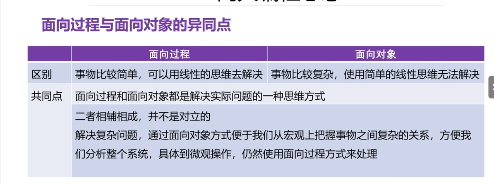
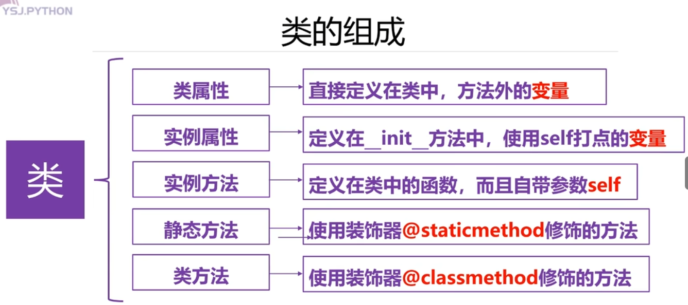
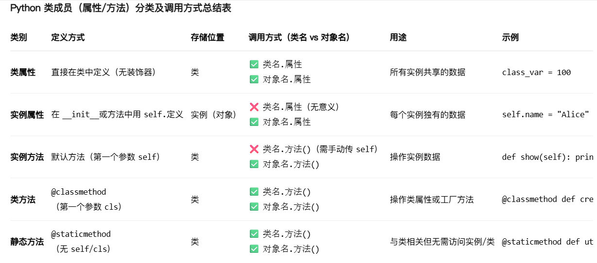
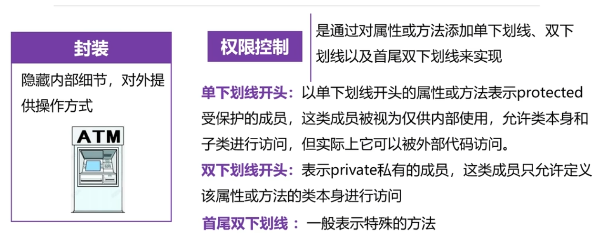
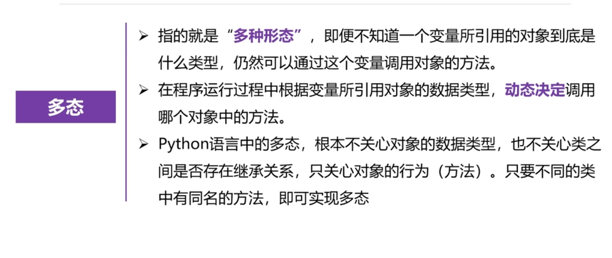
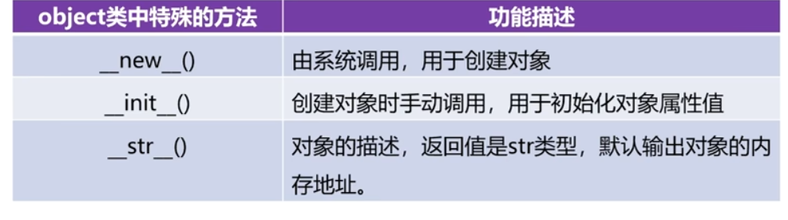
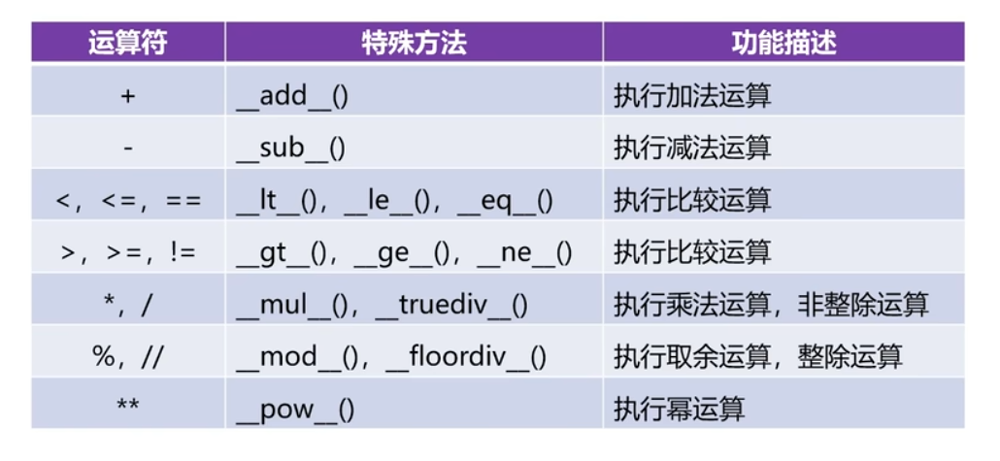
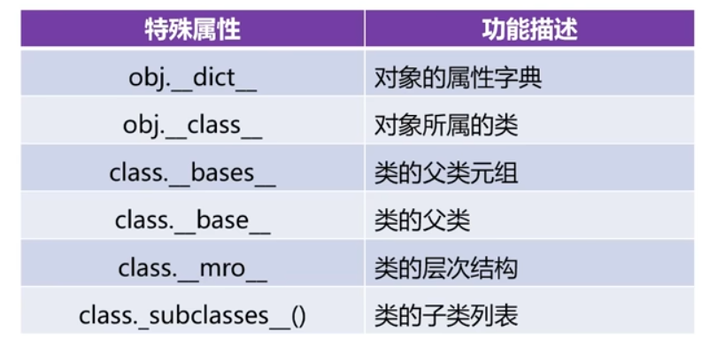
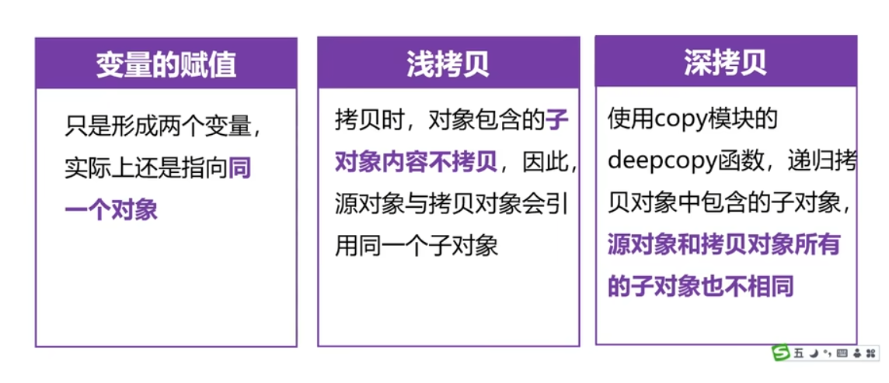

# 面向过程&面向对象 编程思想
- 面向过程：功能上的封装  c语言
- 面向对象：属性和行为上的封装   python,java
- 

# 类：从多个对象抽出“像”的属性和行为归纳总结出的一种类别
1. 自定义数据类型：
   class 类名（）： #()没有继承或默认为object类可以不写，类名必须是首字母大写
             pass
2. 只有创建完对象后才可以使用自定义类：
   变量（对象名）=类名（）
3. 类的组成
   
   - 类属性就是变量只不过是定义在类中
   - ==定义在类中的函数称为方法== 
   - 实例属性可以在整个类中去使用。以self为前缀的变量，可供类中所有方法使用，可以通过任意类的实例来访问
   - 静态方法和类方法不能调用实例属性和实例方法
   - 静态方法没有自带self参数，类方法自带cls参数
   - 实例属性，实例方法使用变量名（对象名）打点调用
   - 类属性，类方法，静态方法使用类名或对象名打点调用
   - 
4. 可以对某个对象绑定独有的属性或方法，直接赋值即可
    ```
    #直接赋值对stu2动态绑定一个实例属性
    stu2.gender='男'
    ```
# 面向对象的三大特征：封装，继承，多态
1. 封装——保护程序的安全

- 如何在类的外部访问私有的实例属性和方法? 
  方法一：实际是通过对象名字打点调用，即私有属性会被自动重命名为 _类名__属性名，私有方法同样会被重命名为 _类名__方法名
  ```
    def _fun(self):
        print('是一个受保护的实例方法，类本身和其子类可以访问')
    def __fun2(self):
        print('是私有的，只有类本身可以访问')
    def show(self): #是普通的实例方法
        self._fun()  #在类的内部，可以访问受保护的实例方法
        self.__fun2()  #在类的内部，可以访问私有的实例方法
        print(self._name)  #在类内部，可以访问受保护的实例属性
        print(self.__age)   #在类内部，可以访问私有的实例属性

    stu=Student('SG',20,'女')

    print(stu._Student__age)  #类的外部访问私有实例属性和方法
    stu._Student__fun2()
  ```
  方法二：使用装饰器@property，将实例属性转成实例方法
  ```
  class Student():
    def __init__(self,name,gender):
        self.name=name
        self.__gender=gender
    #使用装饰器@property修饰方法，将其转化成属性使用,只能查看值，不能修改
    @property
    def gender(self):
        return self.__gender
    #将gender设置为可写属性
    @gender.setter
    def gender(self,value):
        if value!='男'and value!='女':
            print('性别输入有误，将性别默认为女')
            self.__gender = value
        else:
            self.__gender=value

    stu=Student('SG','女')
    stu.gender='男'
    print(stu.name,'的性别是',stu.gender)
   ```
2. 继承——程序的方法的重写，代码的复用
- 被继承的类叫父类或基类，新类叫子类或派生类，拥有父类所有的公有成员和受保护成员
- 一个子类可以拥有多个父类，一个父类可以拥有多个子类
- 一个类若没有任何继承类，则叫object类
- 继承语法：
  ```
  class 类名（父类1，父类2.....父类N）：
        pass
  ```
- 方法体的重写：父类的方法不能完全适应子类的要求时候，可以重写父类的方法
- 子类在重写父类方法时候，要求方法的名称必须与父类相同，在子类重写后的方法中可以通过super().xxx()调用父类中的方法
3. 多态——程序的可扩展性

- Pyhton中的多态不关心对象的数据类型，只关心对象是否有同名的方法
4. object类：是所有的类的直接或间接父类，使用所有类都拥有object类的属性和方法

- __init__()创建对象时候自动调用

# 对象的特殊方法&&特殊属性
1. 对象的特殊方法

调用方法示例
```
print(a+b)
print(a.__add__(b))
```
2. 特殊属性

```
print('对象a的所属类：',a.__class__)
print('C类的父类元组',C.__bases__)  #元组是因为父类不只有一个   若为__base__ 若有多个父类，则只显示第一个父类
print('A类的层次结构：',A.__mro__)   #层次结果显示的是 此类继承了谁
```
- 层次结构显示的是继承了谁
# 类的深拷贝与浅拷贝

- 变量的赋值com1=com，表示com1 com两者指向同一内存空间
- 浅拷贝：
  ```
  import copy
  com2=copy.copy(com) #com2是新产生的对象，com2的子对象cpu,disk不变
  ```
- 深拷贝：
  ```
  #类对象的深拷贝
  import copy
  com3=copy.deepcopy(com) #com2是新产生的对象，com3的子对象cpu,disk也会重新产生
  ```