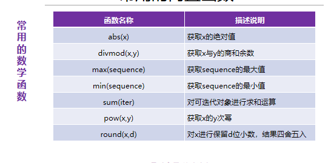

# 函数：将一段实现功能的代码块使用函数名字进行封装，通过函数名称进行调用。以此达到一次编写，多次调用的目的。
1. 内置函数
2. 自定义函数
   语法：def 函数名称（参数列表）:
    函数体
     [return返回值列表]
## 函数参数：分为形式参数（函数定义处）和实际参数（函数调用处）
## 形式参数：
1. 位置参数：调用时的参数个数和顺序必须与定义的参数个数和顺序相同,一一对应进行赋值

2. 关键字参数:“形参名称=值”的方式进行传参，传递参数顺序可以与定义时参数的==顺序不同==

3. 默认值参数:在定义函数时候对参数进行赋值，如果调用函数时候没有对变量进行赋值则使用默认参数值
4. 可变参数：分为个数可变的位置参数和个数可变的关键字参数两种
   - 个数可变的位置参数是在参数前加一颗星（*para），函数调用时可接收任意个数的实际参数，并放到一个==元组==中
   ```
   def fun(*para):
    print(type(para))
    for item in para:
        print(item)

    # 调用
    fun(10,20,30,40)
    fun(10)
    fun([11,22,33,44]) # 实际上传递的是一个参数，
    # 在调用时，参数前加一颗星，分将列表进行解包
    fun(*[11,22,33,44]) #传递的是四个参数，11 22 33 44
   ```
   - 个数可变的关键字参数是在参数前加两颗星(**para)，在函数调用时可接收任意多个 “参数=值”形式的参数，并放到一个==字典==中。
   ```
   def fun2(**kwpara):
    print(type(kwpara))
    for key,value in kwpara.items():
        print(key,'-----',value)

    # 调用
    fun2(name='娟子姐',age=18,height=170) # 关键字参数

    #不能直接传递一个字典，需对字典进行解包
    #使用 **d 解包字典时，Python 会​​自动将字典的键值对转换为关键字参数的形式​​

    d={'name':'娟子姐','age':18,'height':170}
    #fun2(d) # TypeError: fun2() takes 0 positional arguments but 1 was given:函数需要 0 个位置参数，但实际传入了 1 个,接收的关键字参数却收到位置参数，类型不符

    fun2(**d) #系列解包操作
    ```
**注意：**
- 位置参数和关键字参数在函数调用时候可以同时使用，但位置参数在前，关键字参数在后
  ```
  happy_birthday('陈梅梅',age=18) # 正常执行， 位置传参，也可以使用关键字传参
  ```
- 若在函数定义时候有默认值参数和位置参数，默认值在后，位置参数在前
  ```
  def fun(a,b=20): # a作为位置 参数,b默认值参数
    pass

  def fun2(a=20,b): # 报错了，语法错误    ，当位置参数和默认值参数同时存在的时候，位置参数在后会被报错
    pass
  ```
## 返回值
- 返回值可以是一个值，或多个值，如果返回的值是多个，结果是一个元组类型。
  ```
  #对多个返回值元组形式进行解包赋值
    a,b,c=get_sum(10) # 返回3个值，元组类型
    print(a)
    print(b)
    print(c)
    ）
  ```
- return可以出现在函数中的任意一个位置，用于​​立即结束函数​​并返回结果
  ```
  def greet(name):
    if not name:  # 如果名字为空
        return "名字不能为空！"  # 提前终止
    
    return f"你好，{name}！"

    print(greet(""))      # 输出: "名字不能为空！"
    print(greet("小明"))  # 输出: "你好，小明！"解释这个函数的两个print 的执行逻辑
    ```
- 有返回值可以存储到变量中进行使用，也可以直接参与下次函数调用，**没有返回值打印结果是None**
## 变量作用域：局部变量和全局变量
- 局部变量：在函数定义处的参数和函数内部定义的变量   
  作用范围：仅在函数内部，函数执行结束，局部变量的生命周期也结束
- 全局变量：在函数外定义的变量或函数内部使用global关键字修饰的变量
  作用范围： 整个程序，程序运行结束，全局变量的生命周期才结束
- 当局部变量和全局变量同名时候，局部变量优先
- 在函数中变量的声明和赋值必须分开
## 匿名函数lambda :没有名字的函数，这种函数只能使用一次，一般是在函数的函数体==只有一句代码且只有一个返回值==时，可以使用匿名函数来简化(result=lambda 参数列表:表达式)
```
s=lambda a,b:a+b # s表示就是一个匿名函数
print(type(s)) # <class 'function'>
# 调用匿名函数
print(s(10,20))
# print(s)是错误，​​s 是函数对象，print(s) 会输出函数的内存地址信息（如 <function <lambda> at 0x000001...>），而不是计算结果
```
## 递归函数：在一个函数的函数体内调用该函数本身，该函数就是递归函数
一个完整的递归操作由两部分组成，一部分是递归调用，一部分是递归终止条件，一般可使用if-else结构来判断递归的调用和递归的终止。
## 常用的内置函数（可直接调用）
- 
- dict()转换成字典类型
- 浮点型和字符串可以转换成整型，但'98.6''a'不可以转换成整型
- 
- round(3.14,0),“0”表示保留整数，若为“-1”表示对个位进行四舍五入
- 
- 迭代器是 Python 中一种​​惰性计算​​的可迭代对象，每次调用 next() 返回一个元素，直到耗尽。
- 
- map()对可迭代对象的每个元素应用指定函数，返回一个​​迭代器​​，包含所有处理后的结果
- filter(function, iterable)根据指定的条件（函数）==过滤可迭代对象==，返回一个​​迭代器​​，包含所有满足条件的元素,**如果函数对某个元素返回 True，则该元素被保留,返回 False，则该元素被过滤掉**，如果为 None，则过滤掉假值（如 0、""、False）
```
    nums = [1, 2, 3, 4]
    filtered = filter(lambda x: x % 2 == 0, nums)  # 保留偶数
    print(list(filtered))  # 输出: [2, 4]
```
  
- 
- format(value, format_spec),value​​：要格式化的值（数字、字符串、对象等）format_spec​​：格式规则（字符串形式），决定如何呈现 value.**有两种使用方式 直接调用 format() 函数​或者通过字符串的 .format() 方法**