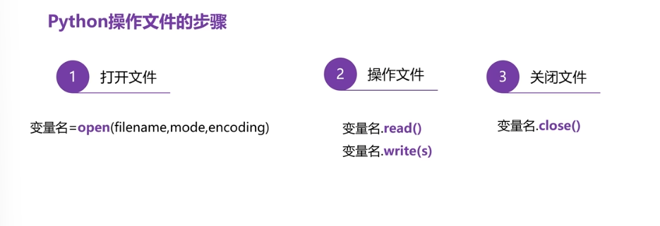
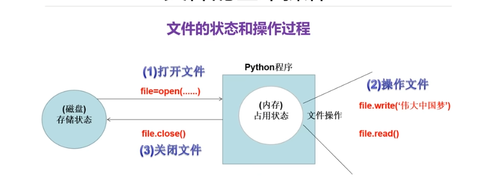
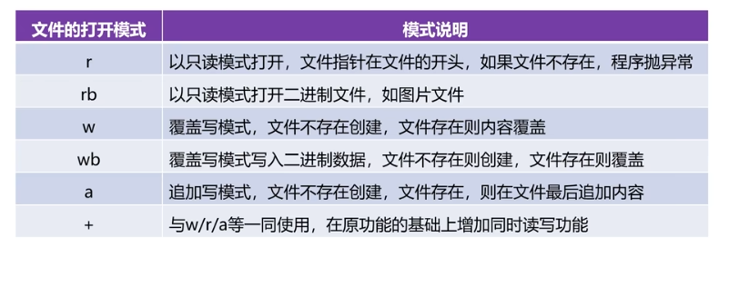
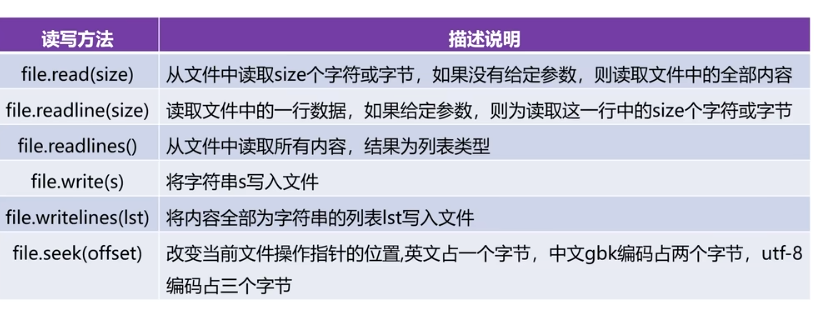
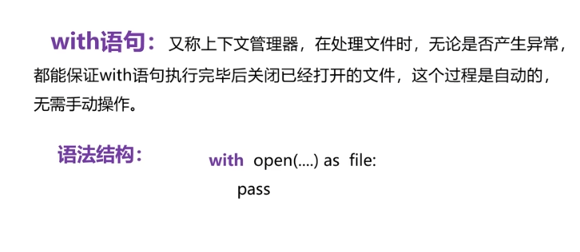

## 文件：
- 存储在计算机的存储设备中的一组数据序列就是文件
- 不同类型的文件通过不同的后缀名进行区分
### 文件分为文本文件&二进制文件
- 文本文件：由于编码格式的不同，所占磁盘空间的字节数不同
  GBK编码，一个中文占两个字节。utf-8编码，一个中文三个字节
- 二进制文件：没有统一的编码，文件直接由0或1组成，需要使用指定的软件才能打开
### 使用python操作文件

- filename是文件的==路径==，若跟所在脚本在目录则只需要写文件名字，否则需要写文件的绝对路径
- mode是打开模式：读/写
- encoding 文件编码格式
- 如果打开文件不存在，直接创建文件
- 操作文件：变量名.write(输入的只能是字符串类型)
### 文件操作
- 文件状态
- 存储状态：文件未被打开的状态，不可操作
-  
- 
- file.readline()会从文件中读取当前指针位置开始的一行内容，并将文件指针移动到下一行的开头。每调用一次，都会读取一行数据。
- 想读取中间或特定位置的数据，用file.seek()挪动指针的位置
- file.read(2) '2'指的是两个字节
- 文件的复制就是边读边写操作
- 若同时打开两个文件，先打开的后关闭，后打开的先关闭。因为Python的 ​​资源管理机制遵循 ==​"后进先出"==的规则，类似于栈的结构，​​先打开的文件​​ 会被 ​​后关闭​​（因为它位于栈的底部），​​后打开的文件​​ 会被 ​​先关闭​​（因为它位于栈的顶部）。
### with语句
