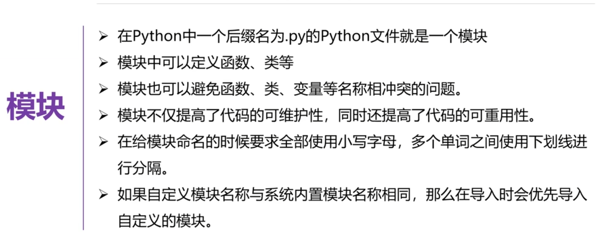
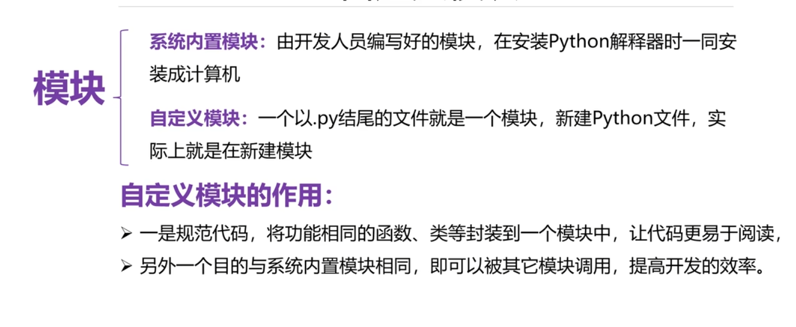
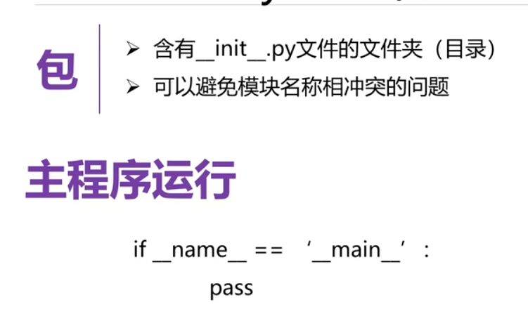
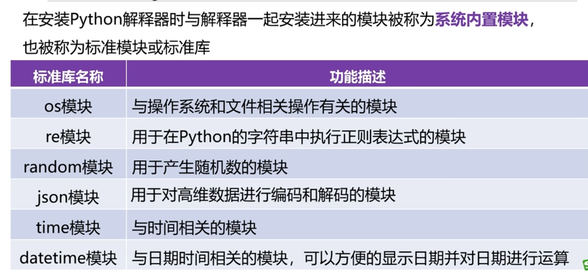
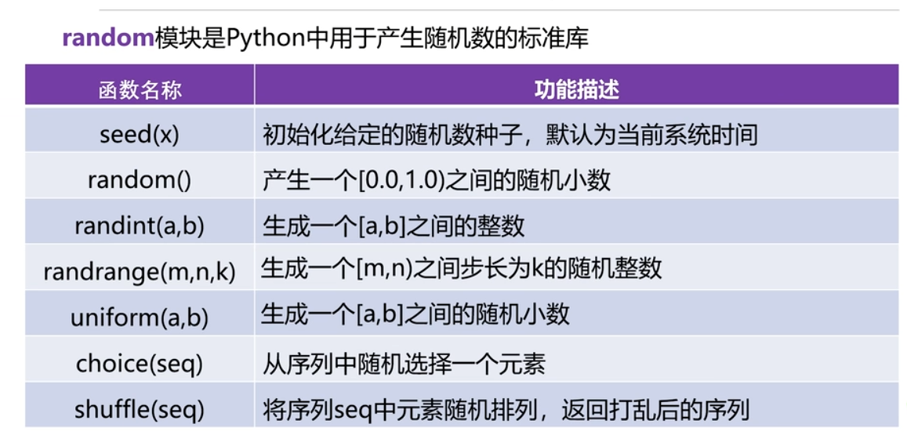
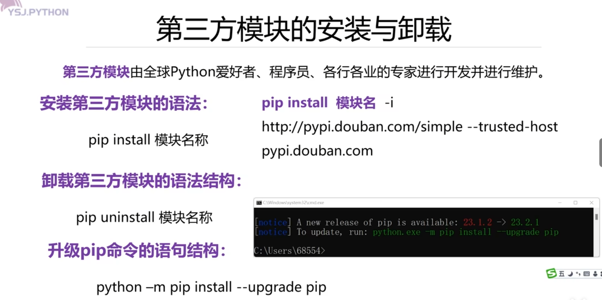

## 模块介绍
 
 
## 模块导入
1. 方法一：
   ```
   import 模块名 [as别名]  #别名可有可无，以用模块别名调用模块
   ``` 
2. 方法二：
   ```
   from 模块名 import 函数/变量/类/* 
   #调用模块里的具体的函数/变量/类，使用时候就不再需要模块名作为前缀
   #‘*’是导入模块内的所有东西
   #仅能使用被导入的部分
   ```
- 可以导入多个模块用英文逗号分隔
- 如果导入的多个模块中有同名的函数或变量则后面导入的模块会对前面导入的模块进行覆盖，如果不想覆盖则用“import+模块名”方式导入，调用时用“模块名.调用对象”来调用则不会发生覆盖
  
## 包介绍

- 要想使用包中的模块中定义的变量或函数，需要先导入包再导入对应的模块
 方法一：
  ```
  import 包名.模块名 [as 模块别名]
  ```
  方法二：
  ```
  from 包名 import 模块名 as 别名
  ```
- 当包被导入时候，init文件中的代码会自动执行，但仅执行一次
- 主程序运行阻值该模块被导入时候执行全局变量，即在新模块导入其他模块时候，不想执行被导入模块的一些代码，则将这些代码放到主程序中去运行

## Python 内置模块


- seed()如果给的随机数种子相同那么得到的随机数也相同
- 随机数种子：随机数种子是一个初始值，用于初始化伪随机数生成器(PRNG)的算法。计算机生成的"随机数"实际上是​==​伪随机数==​​，因为它们是通过确定性算法计算出来的，只是看起来随机而已。使用相同的种子会产生相同的随机数序列，可做到数据重现
- randrange()是每次从可能取值中任意取出一个数

## 第三方模块的安装与使用

- 先用Windows+R 打开电脑运行窗口输入cmd（Windows系统的命令行解释器），再输入安装模块的语法==实操所得：由于PyCharm和Windows的cmd命令不在同一路径，想在PyCharm中使用需在PyCharm的终端安装==
- pip install 模块使用国外的镜像源安装，若网络不好可以使用pip install 模块名 -i http... 则会使用国内的镜像源安装
- 镜像源：是指存储了与原始服务器完全相同内容的备用服务器或站点，主要用于提高访问速度和可靠性。镜像源是原始数据源的完整副本，定期与主源同步更新。为了解决网络延迟、带宽限制和避免单一服务器过载
### 命令解释
- pip install 模块名称  #基础安装命令 pip​​：Python的包管理工具(可以想象成手机的"应用商店")
- pip install 模块名 -i http://pypi.douban.com/simple --trusted-host pypi.douban.com  #​使用国内镜像源加速安装  ​-i​​：指定下载源(就像选择离你更近的商店去购物)
- pip uninstall 模块名称  #​​uninstall​​：卸载指令，执行后会询问是否确认删除，输入y确认
- [notice] A new release of pip is available: 23.1.2 -> 23.2.1  # pip升级提示，用python -m pip install --upgrade pip升级，其中python -m pip​​：用Python运行pip模块


实操问题一：在Windows的cmd命令框中安装完目标第三方模块后，在PyCharm依旧无法使用
- 原因：Python 环境隔离​：（PyCharm 默认会为每个项目创建独立的 ​​虚拟环境​​（如 .venv），而 cmd中安装的模块是全局环境或另一个 Python 环境下的。 
- 环境隔离的表现：
  1. cmd中执行 pip list能看到模块，但 PyCharm 中提示ModuleNotFoundError
  2. PyCharm 和 cmd使用的 ​​Python 解释器路径不同​​（关键原因）
- 验证：在 PyCharm 的 ​​Terminal​​ 和系统的 cmd中分别运行以下命令，对比输出
  1. cmd输出：C:\Users\sgyr\AppData\Local\Programs\Python\Python313\python.exe
  2. PyCharm 的 ​​Terminal​​输出：
   C:\Users\sgyr\PycharmProjects\PythonProject\.venv\Scripts\python.exe
- 结果：输出路径不同，说明环境不一样

## 常用的第三方模块
### pdfplumber:从pdf文件中去读取内容
1. 安装模块: pip install pdfplumber
2. 使用模块
   ```
    import pdfplumber
    #打开PDF文件
    with pdfplumber.open("D:\桌面\作业\数据传输技术及应用\STC开发板各模块解析.pdf") as pdf:
    for i in pdf.pages: #遍历页数
        print(i.extract_text()) #extract_text()方法提取内容
        print(f"-------第{i.page_number}页")#i.page_number显示对象i的第几页
    ```
3. 如果所访问的文件与所运行的脚本不在同一目录下，需要用绝对路径来调用
   - 获取当前脚本所在目录：
  ```
  import os
  print(os.getcwd())  # 查看当前工作目录
  ```
4. 上述调用方法仅能访问文字，不能访问图片
### Numpy：是Python数据分析方向和其他库的依赖库，用于处理数组、矩阵等数据（不懂）
### Pandas & Matplotlib:
- Pandas是基于numpy模块扩展的一个非常重要的数据分析模块，使用pandas读取excel数据更方便
- Matplotlib用于数据可视化的模块，使用Matplotlib.pyplot可以很方便的绘制饼状图、柱形图、折线图
- 